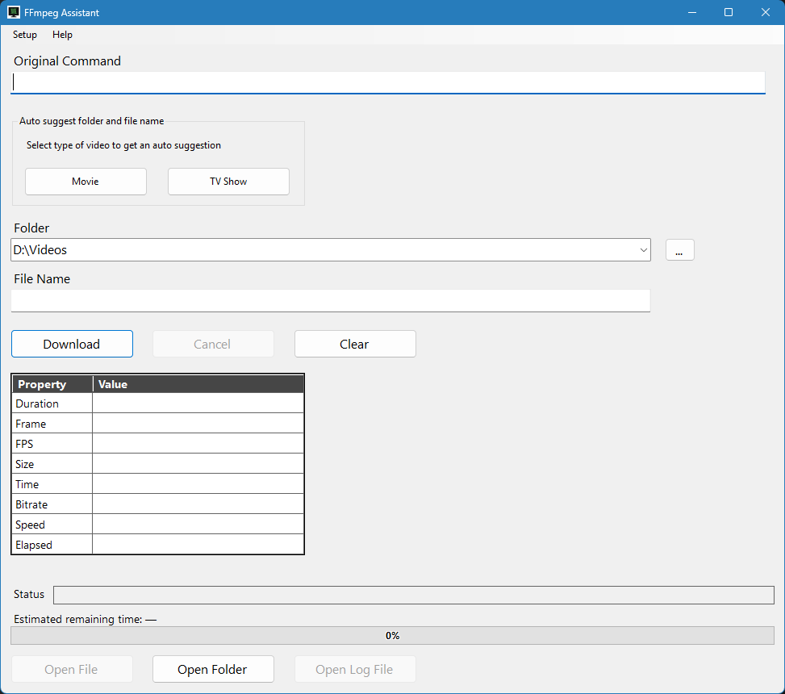

# FFmpegAssistant

A Windows Forms application that is an extension to the web browser extension Privatkopiera, that helps you run FFmpeg commands by letting you paste an existing command, choose an output folder, and specify a file name — then executes the modified command for you.

Basically, this is a user interface for the web browser extension Privatkopiera, so this is like a user interface for that addon. Privatkopiera can be downloaded from the website https://github.com/stefansundin/privatkopiera

## Instruction Video
- https://youtu.be/AiEukK-xyYI

## Features

- Detects FFmpeg commands on the clipboard at startup
- Auto-suggests output folder and file name for Movies and TV Shows
- Auto-increments episode numbers based on existing files in the folder
- Season and Episode boxes let you override the auto-suggested episode number
- Real-time progress grid (duration, frame, FPS) with progress bar
- Estimated remaining time with stable speed sampling
- Watch while downloading — streams to a .ts file so you can open it immediately, then converts to the final format automatically when the download is complete
- Power outage protection — downloads to a `(part)` file and only renames it to the final name after the file has been validated
- Cancel mid-download with optional cleanup of the partial file
- File-exists protection before overwriting
- FFmpeg validation of the completed file
- Automatic update check against GitHub Releases on startup
- Create Desktop and/or Start Menu shortcuts via Setup menu
- Application log stored in `%APPDATA%\SweWolfSoftware\FFmpegAssist`

## Requirements

- Windows 10 or later
- .NET 10
- FFmpeg available on the system PATH
- The web browser extension Privatkopiera (see https://stefansundin.github.io/privatkopiera )

## License

MIT
