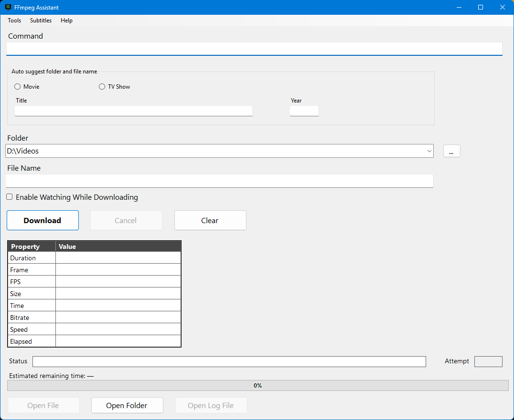

# FFmpegAssistant

A Windows Forms application that is an extension to the web browser extension Privatkopiera, that helps you run FFmpeg commands by letting you paste an existing command, choose an output folder, and specify a file name — then executes the modified command for you.

Basically, this is a user interface for the web browser extension Privatkopiera, so this is like a user interface for that addon. Privatkopiera can be downloaded from the website https://github.com/stefansundin/privatkopiera

## Instruction Video
- https://youtu.be/AiEukK-xyYI

## Features

- Auto-suggests output folder and file name for Movies and TV Shows
- Title box shows/lets you edit the detected show or movie title used for the output filename
- Auto-increments episode numbers based on existing files in the folder
- Season and Episode boxes let you override the auto-suggested episode number
- Real-time progress grid (duration, frame, FPS) with progress bar
- Estimated remaining time with stable speed sampling
- Color-coded status messages for at-a-glance progress, warnings, and errors
- Watch while downloading — streams to a .ts file so you can open it immediately, then converts to the final format automatically when the download is complete
- Power outage protection — downloads to a `(part)` file and only renames it to the final name after the file has been validated
- Auto-retry on failure — configurable maximum number of attempts; each retry is shown in the Attempt counter
- Validates the downloaded video file after each attempt
- Extract an embedded subtitle track from a video file, or download subtitles directly from an M3U8 stream
- Cancel mid-download with optional cleanup of the partial file
- Close protection — warns if you try to close the app during a download and deletes the partial file automatically
- File-exists protection before overwriting
- Automatic update check against GitHub Releases on startup
- Create Desktop and/or Start Menu shortcuts via Tools menu

### Settings (Tools → Settings)

- **FFmpeg path** — set a custom path to `ffmpeg.exe` for systems where FFmpeg is not on the system PATH; leave empty to use PATH resolution
- **Auto-retry on failure** — set the maximum number of download attempts (leave empty, 0, or 1 to disable auto-retry)
- **Check for new version at startup** — Yes/No toggle for the automatic update check
- **Action when download finished** — Play a Sound (built-in or your own custom file), show a Message Box, or None

### Application log

Stored in `%APPDATA%\SweWolfSoftware\FFmpegAssist`

## Requirements

- Windows 10 or later
- .NET 10
- FFmpeg — either on the system PATH or configured via Tools → Settings
- The web browser extension Privatkopiera (see https://stefansundin.github.io/privatkopiera )

## License

MIT
