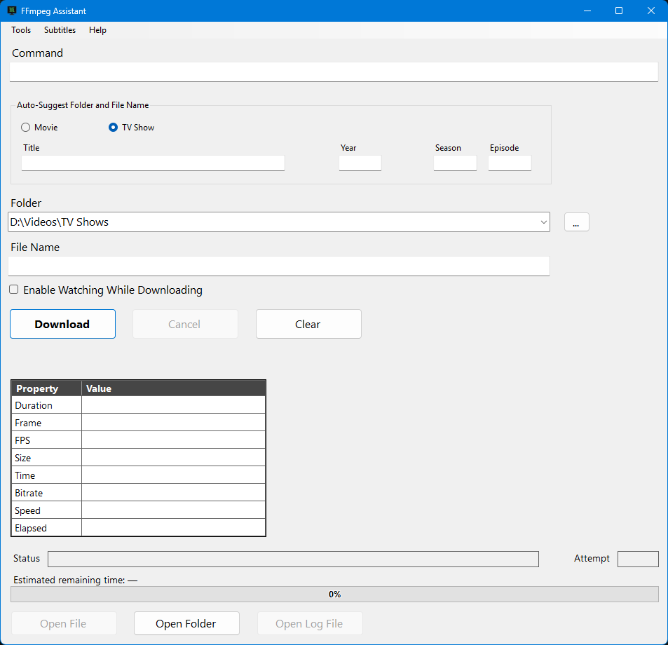

# FFmpegAssistant

A Windows desktop app that works together with the web browser extension [Privatkopiera](https://github.com/stefansundin/privatkopiera). Privatkopiera gives you an FFmpeg command for the video you are watching; paste it into FFmpeg Assistant, choose a folder and a file name, and the app runs the command for you, with live progress, validation of the downloaded file and automatic retries.

In other words, FFmpeg Assistant is a user interface for the commands that Privatkopiera creates.

## Instruction Video
- https://youtu.be/AiEukK-xyYI

## Features

### Downloading
- Auto-suggests the output folder and file name for Movies and TV Shows
- Title box shows (and lets you edit) the detected show or movie title used for the output file name
- Auto-increments episode numbers based on existing files in the folder
- Season and Episode boxes let you override the auto-suggested episode number
- Real-time progress grid (duration, frame, FPS, size, time, bitrate, speed, elapsed) with a progress bar
- Estimated remaining time with stable speed sampling
- Color-coded status messages: light yellow while in progress, orange when retrying, red on errors and green when done
- Watch while downloading: streams to a .ts file so you can open it immediately, then converts it to the final format automatically when the download is complete
- Power outage protection: downloads to a `(part)` file and only renames it to the final name after the file has been validated
- Auto-retry on failure: configurable maximum number of attempts; each retry is shown in the Attempt counter
- Validates the downloaded video file after each attempt
- Keeps the PC awake during a download, so it doesn't go to sleep halfway (the screen can still turn off)
- Flashes the taskbar button when a download finishes or fails while you are working in another window

### Tools
- **Validate Video File** (Tools menu): check any video file on your computer with the same FFmpeg check that runs after a download
- Extract an embedded subtitle track from a video file, or download subtitles directly from an M3U8 stream
- Create Desktop and/or Start Menu shortcuts via the Tools menu
- Automatic update check against GitHub Releases on startup

### Safety checks
- Asks before creating an output folder you typed yourself (folders the app suggests are created automatically)
- Checks the output folder and file name for characters that aren't allowed in file names before FFmpeg runs
- File-exists protection before overwriting
- Cancel mid-download with optional cleanup of the partial file
- Close protection: warns if you try to close the app during a download and deletes the partial file automatically

### Fits any screen
- Adapts to small screens and display scaling: when the window is short, the progress grid shows its values side by side, and if that isn't enough, the window scrolls instead of controls overlapping

### Keyboard shortcuts

| Shortcut | Action |
|---|---|
| Ctrl+E | Download |
| Ctrl+O | Open File |
| Ctrl+Shift+O | Open Folder |
| Alt+B | Browse for the output folder |
| F6 | Go to the Command box |

### Settings (Tools → Settings)

- **FFmpeg path**: set a custom path to `ffmpeg.exe` for systems where FFmpeg is not on the system PATH; leave it empty to use the PATH
- **Auto-retry on failure**: set the maximum number of download attempts (leave it empty, 0 or 1 to disable auto-retry)
- **Check for new version at startup**: Yes/No toggle for the automatic update check
- **Action when download finished**: play a sound (built-in or your own custom file), show a message box, or do nothing

### Logs

- Application log: `%APPDATA%\SweWolfSoftware\FFmpegAssist\FFmpegAssistant.log`
- FFmpeg's output for each download or validation: `%APPDATA%\SweWolfSoftware\FFmpegAssist\Logs` (opened with the Open Log File button)

## Requirements

- Windows 10 or later
- .NET 10 (only for the small download; the standalone exe includes it)
- FFmpeg, either on the system PATH or configured via Tools → Settings
- The web browser extension Privatkopiera (see https://stefansundin.github.io/privatkopiera)

## License

MIT
